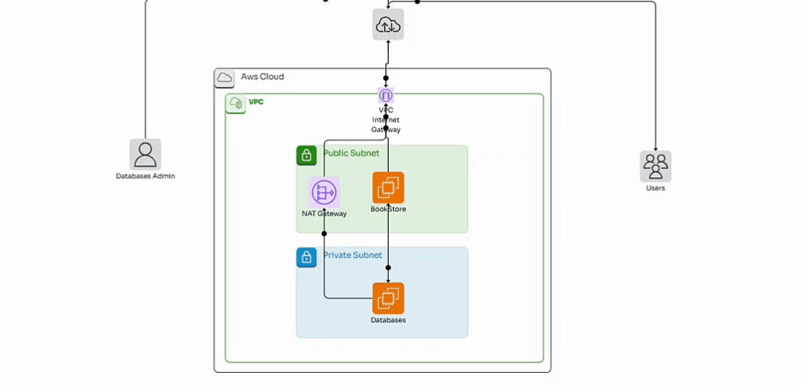

# ec2-databases

  

## Vamos a implementar la siguiente arquitectura en AWS



<hr>
1. Vamos a configurar la siguiente infraestructura de red.

   - Configuramos el servicio VPC con el siguiente CIDR ipv4: 

     - 192.168.0.0/16
    
   - Configuramos dos subredes:

     - **PublicSubnetA**:
          - Availability Zone: a
          - CIDR: 192.168.1.0/24
            
      - **PrivateSubnetA**:
          - Availability Zone: a
          - CIDR: 192.168.2.0/24 
     

   Necesitamos que nuestra VPC tenga conexión a internet por lo tanto  necesitamos configurar un **Internet Gateway**.

   - Cuando el Internet Gateway se haya creado, se relaciona a la VPC
   - Se crea una tabla de enrutamiento (Route Table)
   - La route table se asocia a la **Public Subnet** y se crea una ruta para indicar la conexión a internet a través del **Internet Gateway** 


   Como vamos a crear una instance en la subred privada necesitamos que esa instancia se conecte a internet a través de un **Nat Gateway** 

   - El Nat Gateway se crea en la **Public Subnet**
   - En la creación del Nat Gateway se le asocia una IP elástica. 
   - Se crea una tabla de enrutamiento (Route Table)
   - La Route Table se asocia a la **Private Subnet** y se crea una ruta para indicar la conexión a internet a través del **Nat Gateway** 

<hr>

2. Vamos al servicio AWS EC2. 

   Creamos dos grupos de seguridad.

      - El primer grupo de seguridad con los siguientes parámetros:
      
         - Name: web-server-SG
         - Inboud rules:
            - Type: Custom TCP
            - Port Range: 5000
            - Source: 0.0.0.0/0
            - Type: ssh
            - Port Range: 22
            - Source: myIP
              
      - El segundo grupo de seguridad con los siguientes parámetros:      
          
         - Name: database-SG
         - Inboud rules:
            - Type: MYSQL/Aurora
            - Port Range: 3306
            - Source: web-server-SG *(The SG of the web server)*

   Creamos una instancia EC2 donde vamos a configurar el servidor web. La instancia tiene las siguientes configuraciones:
   
     - AMI: *Amazon Linux 2023*
     - Instance Type: *t2.micro*
     - Key Pair: associate a key pair
     - Network settings:
        - VPC
        - Public Subnet: enable *Public IP*
        - Security Group: web-server-SG
     - Advanced details:

        - User data: *copy the next following lines to the user data*
           ```
           #!/bin/bash
           sudo dnf install -y python3.9-pip
           pip install virtualenv           
           sudo dnf install -y git           
           pip install flask
           pip install mysql-connector-python
           pip install boto3
           git clone https://github.com/jhormanvillanueva/ec2-databases.git
            ```
      - Una vez que la instancia se está ejecutando puedes conectarte a través de SSH y comprobar que las librerías se han instalado y que el repositorio de GitHub se ha clonado.  
                   
      - Para correr el servidor web debes ubicarte en la carpeta que se ha clonado donde está el archivo app.py. Verifica que el grupo de seguridad tiene los puertos respectivos abiertos y ejecuta los siguientes comandos.

               python3 -m virtualenv venv
               source venv/bin/activate
               python app.py 
               
   Creamos una segunda instancia donde vamos a configurar la base de datos. Esa instancia tiene las siguientes configuraciones:   
      
     - AMI: *Amazon Linux 2023*
     - Instance Type: *t2.micro*
     - Key Pair: associate a key pair
     - Network settings:
        - VPC
        - Private Subnet
        - Security Group: database-SG
     - Advanced details:

        - User data: *copy the next following lines to the user data*
           ```
           #!/bin/bash           
           sudo dnf install -y mariadb105-server
           sudo dnf install -y git
           sudo service mariadb start
           sudo chkconfig mariadb on           
           git clone https://github.com/jhormanvillanueva/ec2-databases.git
           sudo mv ec2-databases /home/ec2-user
            ```
      
      - Una vez que la instancia se está ejecutando nos debemos conectar a la terminal de comandos a través de SSH. Como la instancia está en una subred privada, nos debemos conectar a través de la instancia que está en la subred pública utilizando la key pair con extensión .pem.  

      - Ya en la terminal de comandos de la instancia, verificamos que se haya clonado el repositorio e ingresamos a la carpeta databases. Dentro de esa carpeta ejecutamos los siguientes comandos:
        
                sudo chmod +x set-root-user.sh createdb.sh
                sudo ./set-root-user.sh
                sudo ./createdb.sh
      
      - Podemos comprobar que la base de datos se ha creado de forma exitosa ejecutando los siguientes comandos:
        
                sudo mysql 
                show databases;
                use books_db;
                show tables;
                SELECT * FROM Books;  

   Una vez configurada la base de datos se puede comprobar que la aplicación que corre en el instancia que está en la subred pública puede hacer consultas a la base de datos que se está ejecutando en la instancia que está en la subred privada. Recuerda que debes modificar la dirección de host.     
      
      
<hr>

